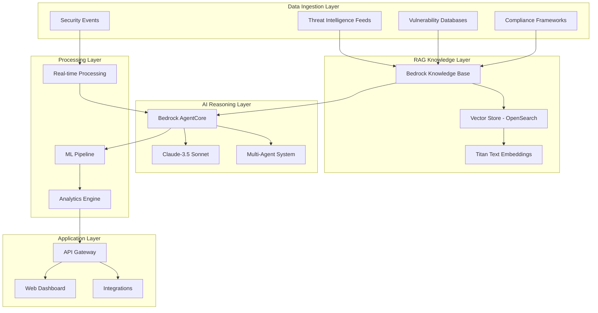

# THRAG Design Document

## Overview

THRAG (Threat Hunting Retrieval Augmented Generation) is a cloud-native AI-powered cybersecurity platform that combines retrieval augmented generation with advanced machine learning to transform raw security telemetry into actionable threat intelligence. The system leverages Amazon Bedrock Knowledge Bases for RAG capabilities, Amazon Bedrock AgentCore for multi-agent orchestration, and Claude-3.5 Sonnet for sophisticated reasoning about security threats.

The platform operates through a multi-layered architecture that ingests threat intelligence from various sources, processes real-time security events, and provides autonomous threat hunting, incident response, and predictive security capabilities.

## Architecture

### High-Level Architecture



### Core Components

1. **RAG-Powered Knowledge Architecture**
   - Threat Intelligence Knowledge Base with MISP feeds, CVE databases, NIST frameworks, MITRE ATT&CK
   - Security Playbook Repository with incident response procedures and compliance requirements
   - Historical Attack Database with analyzed breach reports and adversary behavior patterns
   - Real-time Security Embeddings for live security events

2. **Multi-Agent Orchestration System**
   - Bedrock AgentCore coordinating 6 specialized RAG-powered agents
   - Context sharing and collaboration mechanisms
   - Priority-based conflict resolution

3. **Advanced ML Pipeline**
   - Time-series anomaly detection for network/system metrics
   - NLP analysis of log narratives for semantic anomalies
   - Graph neural networks for relationship analysis
   - Behavioral baseline modeling with Isolation Forest and LSTM autoencoders

## Components and Interfaces

### 1. Data Ingestion Service

**Purpose:** Continuously ingests and processes threat intelligence from multiple sources

**Components:**
- **Threat Feed Ingester:** Processes MISP feeds, CVE databases, threat actor profiles
- **Security Event Processor:** Handles real-time security events from AWS Security Hub, GuardDuty, CloudTrail
- **Document Processor:** Extracts and chunks security documents for optimal retrieval
- **Embedding Generator:** Creates vector embeddings using Amazon Titan Text Embeddings

**Interfaces:**
- REST APIs for external threat intelligence feeds
- AWS SDK integration for security services
- S3 integration for document storage
- OpenSearch integration for vector storage

### 2. RAG Knowledge Management System

**Purpose:** Manages the retrieval augmented generation knowledge base and semantic search

**Components:**
- **Knowledge Base Manager:** Maintains Bedrock Knowledge Base with threat intelligence
- **Vector Database:** Amazon OpenSearch Serverless for semantic search
- **Retrieval Engine:** Hybrid search combining semantic similarity and keyword matching
- **Context Manager:** Intelligent context pruning for LLM token limits

**Interfaces:**
- Bedrock Knowledge Base APIs
- OpenSearch REST APIs
- S3 integration for knowledge documents
- Custom retrieval APIs for agents

### 3. Multi-Agent Orchestration System

**Purpose:** Coordinates specialized security agents using Bedrock AgentCore

**Agents:**
- **Threat Hunter Agent:** Generates hunt hypotheses and executes complex queries
- **Intelligence Analyst Agent:** Correlates findings with threat intelligence reports
- **Incident Commander Agent:** Creates response plans and coordinates remediation
- **Forensics Investigator Agent:** Guides evidence collection and analysis
- **Compliance Advisor Agent:** Maps incidents to regulatory requirements
- **Communication Specialist Agent:** Generates stakeholder reports and notifications

**Interfaces:**
- Bedrock AgentCore APIs
- Custom Action Groups for each agent
- Inter-agent communication protocols
- External system integration APIs

### 4. Machine Learning Pipeline

**Purpose:** Provides advanced analytics and predictive capabilities

**Components:**
- **Anomaly Detection Engine:** Isolation Forest and LSTM autoencoders for behavioral analysis
- **Threat Pattern Matcher:** ML-based pattern recognition enhanced by retrieved signatures
- **Attack Predictor:** Time-series forecasting with historical attack data
- **Risk Scorer:** Multi-factor risk assessment using vulnerability intelligence

**Interfaces:**
- SageMaker APIs for model training and inference
- Kinesis integration for real-time data processing
- CloudWatch integration for metrics and monitoring
- Custom ML model endpoints

### 5. Real-time Processing Engine

**Purpose:** Handles high-volume security event processing with sub-second latency

**Components:**
- **Event Stream Processor:** Kinesis Data Streams for security event ingestion
- **Real-time Analytics:** Kinesis Analytics for stream processing with retrieved context
- **Event Correlation Engine:** Correlates events using graph neural networks
- **Alert Generator:** Creates intelligent alerts with context from knowledge base

**Interfaces:**
- Kinesis Data Streams APIs
- EventBridge for workflow orchestration
- Lambda functions for event processing
- DynamoDB for real-time state management

## Data Models

### Threat Intelligence Document
```typescript
interface ThreatIntelDocument {
  id: string;
  source: 'MISP' | 'CVE' | 'MITRE' | 'NIST' | 'Custom';
  title: string;
  content: string;
  metadata: {
    confidence: number;
    tlp: 'WHITE' | 'GREEN' | 'AMBER' | 'RED';
    tags: string[];
    created: Date;
    updated: Date;
  };
  embeddings: number[];
  references: string[];
}
```

### Security Event
```typescript
interface SecurityEvent {
  id: string;
  timestamp: Date;
  source: string;
  eventType: string;
  severity: 'LOW' | 'MEDIUM' | 'HIGH' | 'CRITICAL';
  rawData: Record<string, any>;
  normalizedData: {
    sourceIp?: string;
    destinationIp?: string;
    userId?: string;
    action: string;
    resource: string;
  };
  correlationId?: string;
  threatScore?: number;
}
```

### Hunt Query
```typescript
interface HuntQuery {
  id: string;
  name: string;
  description: string;
  query: string;
  dataSource: string[];
  createdBy: 'AGENT' | 'HUMAN';
  basedOnThreatIntel: string[];
  executionHistory: {
    timestamp: Date;
    results: number;
    findings: string[];
  }[];
}
```

### Incident Response Playbook
```typescript
interface IncidentPlaybook {
  id: string;
  incidentType: string;
  severity: string;
  steps: {
    phase: 'PREPARATION' | 'IDENTIFICATION' | 'CONTAINMENT' | 'ERADICATION' | 'RECOVERY' | 'LESSONS_LEARNED';
    action: string;
    description: string;
    automatable: boolean;
    estimatedTime: number;
    dependencies: string[];
  }[];
  basedOnPlaybooks: string[];
  adaptedFor: {
    threatType: string;
    environment: string;
    assets: string[];
  };
}
```

## Error Handling

### 1. RAG System Errors
- **Knowledge Base Unavailable:** Fallback to cached embeddings and local knowledge
- **Retrieval Timeout:** Return partial results with timeout indicators
- **Context Window Exceeded:** Intelligent context pruning with priority ranking
- **Embedding Generation Failure:** Retry with exponential backoff, fallback to keyword search

### 2. Agent Coordination Errors
- **Agent Failure:** Automatic failover to backup agent instances
- **Communication Timeout:** Retry mechanism with circuit breaker pattern
- **Conflicting Recommendations:** Priority-based resolution with human escalation
- **Resource Exhaustion:** Dynamic scaling with queue management

### 3. Real-time Processing Errors
- **Stream Processing Failure:** Dead letter queue with replay capability
- **High Latency:** Auto-scaling with performance monitoring
- **Data Quality Issues:** Validation pipeline with error reporting
- **Correlation Failures:** Graceful degradation with manual review queue

### 4. External Integration Errors
- **API Rate Limiting:** Exponential backoff with request queuing
- **Authentication Failures:** Automatic token refresh with fallback credentials
- **Data Source Unavailable:** Cached data with staleness indicators
- **Network Connectivity:** Retry logic with circuit breaker pattern

## Testing Strategy

### 1. Unit Testing
- **Component Testing:** Individual service components with mocked dependencies
- **Agent Testing:** Each specialized agent with simulated scenarios
- **RAG Testing:** Knowledge retrieval accuracy and relevance scoring
- **ML Model Testing:** Model performance validation with test datasets

### 2. Integration Testing
- **End-to-End Workflows:** Complete threat hunting and response scenarios
- **Agent Coordination:** Multi-agent collaboration and conflict resolution
- **External Integration:** Third-party API integration and error handling
- **Performance Testing:** Load testing with realistic security event volumes

### 3. Security Testing
- **Penetration Testing:** Security assessment of all external interfaces
- **Data Privacy Testing:** Ensure proper handling of sensitive security data
- **Access Control Testing:** Verify role-based access controls and permissions
- **Compliance Testing:** Validate adherence to security frameworks and regulations

### 4. Chaos Engineering
- **Failure Injection:** Simulate component failures and network partitions
- **Load Testing:** High-volume security event processing under stress
- **Latency Testing:** Performance under various network conditions
- **Recovery Testing:** Disaster recovery and business continuity scenarios

### 5. AI/ML Testing
- **Model Accuracy:** Threat detection accuracy and false positive rates
- **Bias Testing:** Ensure fair and unbiased threat assessment across different scenarios
- **Explainability Testing:** Verify reasoning transparency and source attribution
- **Adversarial Testing:** Robustness against adversarial inputs and edge cases